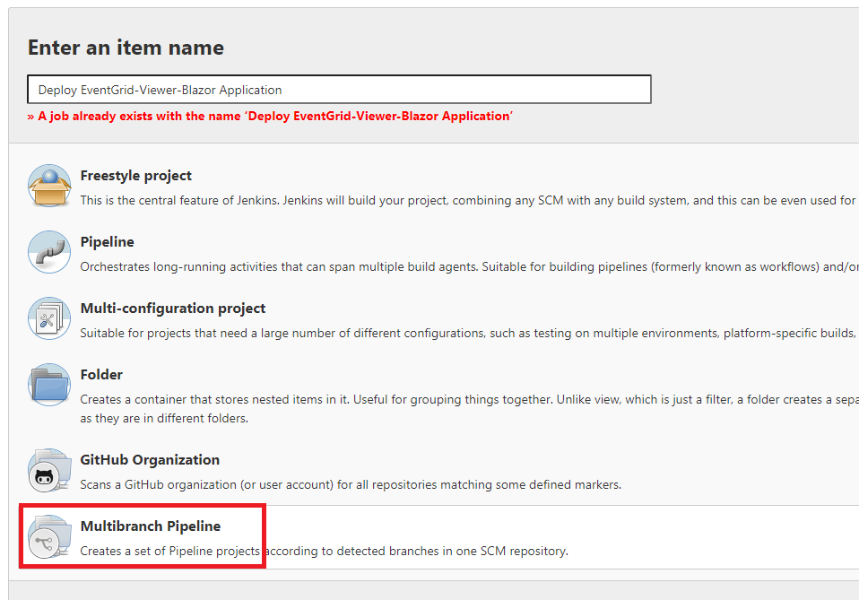
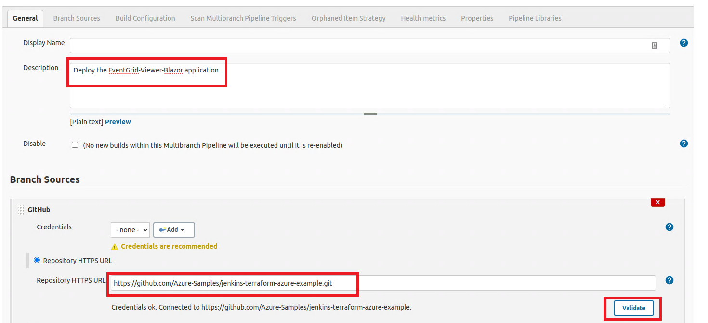
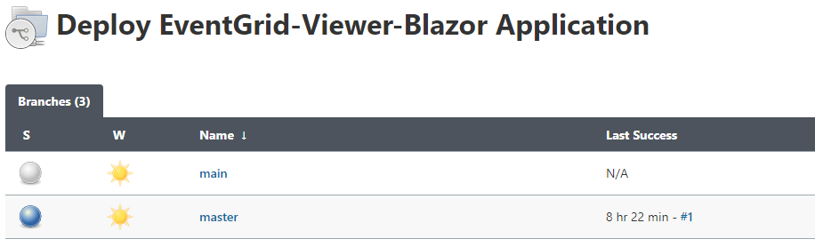
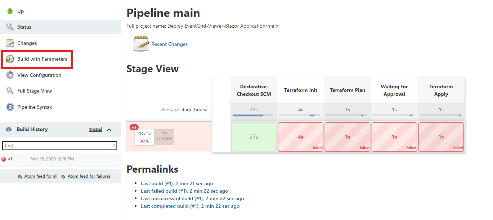
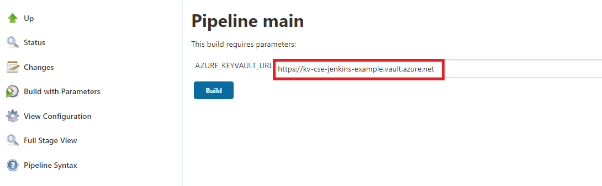
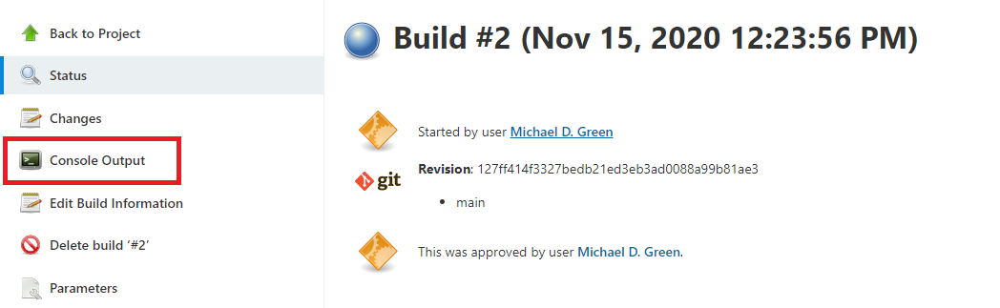
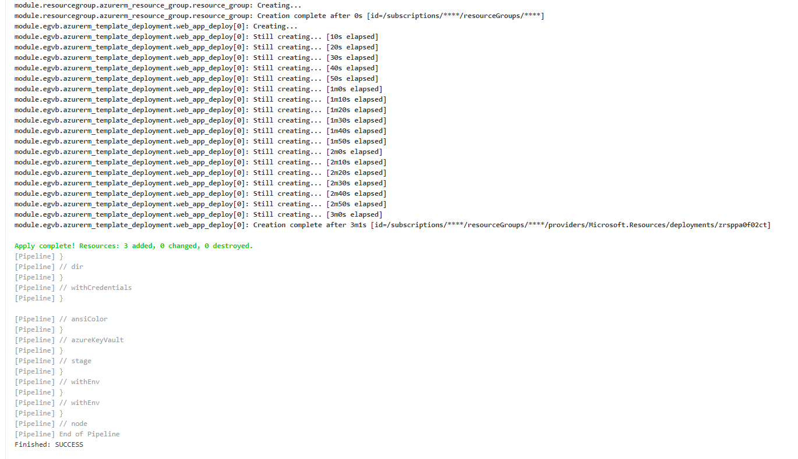
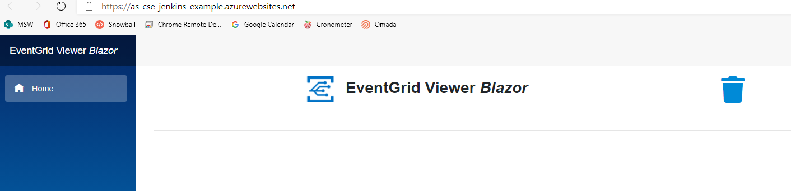
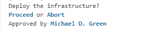

# Overview

The purpose of this README to document:

1. What Jenkins plugins are needed to create a Jenkins Job
1. A brief overview of a Jenkinsfile
1. How to create a Jenkins Job
1. How to Gate a Jenkins Job

## Plug-ins

The following plug-ins are needed:

- [AnsiColor](https://plugins.jenkins.io/ansicolor/)
- [Azure Credentials](https://plugins.jenkins.io/azure-credentials/)
- [Azure KeyVault](https://plugins.jenkins.io/azure-keyvault/)

## Jenkinsfile

The [Jenkinsfile](https://www.jenkins.io/doc/book/pipeline/jenkinsfile/) contains a definition of a Jenkins Pipeline and for this tutorial, we are using the *declarative* syntax.

This section of the Jenkinsfile tells Jenkins to use any available agent.

```yaml
        agent any
```

The environment section of the Jenkinsfile sets environment variables.  Please note that the *KEYVAULT_URL* environment variable was left in the Jenkinsfile for future troubleshooting.  For some reason, it is not able to be de-referenced by the Azure KeyVault Plugin keyVaultURL parameter.

```yaml
    environment {
        TF_IN_AUTOMATION = "true"
        // KEYVAULT_URL = credentials('azure_keyvault_url') # keyVaultURL not able to be dereferenced with ${env.KEYVAULT_URL}, keeping for future reference
    }
```

The parameters section has a hard-coded default build parameter for the Azure KeyVault url, which is need by the [Azure KeyVault Plugin](https://plugins.jenkins.io/azure-keyvault/) to find the Azure KeyVault to query secrets.

```yaml
    parameters {
        string(name: 'AZURE_KEYVAULT_URL', defaultValue: 'https://kv-cse-jenkins-example.vault.azure.net')
    }
```

Next, inside of the *Stages* section, you have one or more stages and each stage will have a step.  In the sample below is the *Terraform Init* stage.  For *options*, the [Azure KeyVault Plugin](https://plugins.jenkins.io/azure-keyvault/) plugin is configured.  The *credentialID* is the id of the Azure Service Principal stored in the Jenkins Credential Store by the *jenkins_admin.sh* script.

In the *secrets* array, you specify the name of the environment variable to store the Azure KeyVault secret, the name of the secret in the Azure KeyVault and the secret Type.

In the *steps* section, we are using the [AnsiColor](https://plugins.jenkins.io/ansicolor/) plugin to color-code Jenkins build output.  Next, the [Azure Credentials](https://plugins.jenkins.io/azure-credentials/) plugin is configured by specifying the Jenkins Credential Id of the Azure Service Principal.  Last, the *dir* function is used to let Terraform know where the configuration files are located & terraform init is executed with paramaters from the Azure KeyVault.

```yaml
        stage('Terraform Init'){

            options {
              azureKeyVault(
                credentialID: "azure_service_principal",
                keyVaultURL: "${params.AZURE_KEYVAULT_URL}",
                secrets: [
                    [envVariable: 'BACKEND_STORAGE_ACCOUNT_NAME', name: 'BACKEND-STORAGE-ACCOUNT-NAME', secretType: 'Secret'],
                    [envVariable: 'BACKEND_STORAGE_ACCOUNT_CONTAINER_NAME', name: 'BACKEND-STORAGE-ACCOUNT-CONTAINER-NAME', secretType: 'Secret'],
                    [envVariable: 'BACKEND_KEY', name: 'BACKEND-KEY', secretType: 'Secret'],
                    [envVariable: 'RG_NAME', name: 'RG-NAME', secretType: 'Secret'],
                    [envVariable: 'ARM_ACCESS_KEY', name: 'BACKEND-ACCESS-KEY', secretType: 'Secret']
                ]
              )
            }

            steps {
                    ansiColor('xterm') {
                    withCredentials([azureServicePrincipal(
                    credentialsId: 'azure_service_principal',
                    subscriptionIdVariable: 'ARM_SUBSCRIPTION_ID',
                    clientIdVariable: 'ARM_CLIENT_ID',
                    clientSecretVariable: 'ARM_CLIENT_SECRET',
                    tenantIdVariable: 'ARM_TENANT_ID'
                )]) {
                        dir("src") {
                        sh """
                        echo "Initialising Terraform"
                        terraform init -backend-config="access_key=$ARM_ACCESS_KEY" -backend-config="storage_account_name=$BACKEND_STORAGE_ACCOUNT_NAME" -backend-config="container_name=$BACKEND_STORAGE_ACCOUNT_CONTAINER_NAME" -backend-config="key=$BACKEND_KEY" -backend-config="resource_group_name=$RG_NAME"
                        """
                        }
                     }
                }
             }
        }
```

## How to Create a Jenkins Job

Next, it is time to create the Jenkins Job.  Navigate to the <aci_FQDN>:8080 instance login.

1. Click *New Item*
1. In the Pipeline Wizard, give the Pipeline a name & choose *Multibranch Pipeline*



1. On the Pipeline Properties screen, enter a description
1. Choose the appropriate GitHub credentials & GitHub repository url
1. For the Build Configuration section, the Mode should be *by Jenkinsfile*
1. After this, save the Pipeline



Once the Jenkins Pipeline is created, you should see a list of all the repository branches:



## How to Run a Jenkins Job

1. Once you have saved the Jenkins Pipeline, you will be taken to the Job/Pipeline screen for the Job
1. In the left-hand menu, choose *Build with Parameters*
1. Replace the default value of *AZURE_KEYVAULT_URL* with the url of the KeyVault created by the [azure_admin.sh](scripts/azure_admin.sh) script
1. In the bottom left corner, there is a *Build History* section that displays all the executed jobs.  Click on the latest number to view the output of the job
1. On the *Build Screen*, you will want to choose *Console Output* to view the output of the job
1. Navigate to <https://as-{prefix}-jenkins-example.azurewebsites.net> to view the deployed evengrid-viewer-blazor application.  To learn how to use the application see instructions [here](https://github.com/azure-samples/eventgrid-viewer-blazor)







## How to Gate a Jenkins Job

To gate a step, you can do this in the Jenkinsfile.

```groovy
        stage('Waiting for Approval'){
            steps {
                timeout(time: 10, unit: 'MINUTES') {
                    input (message: "Deploy the infrastructure?")
                }
            }

        }

```

The result will be that in the *Console Output*, a *Proceed or Abort* link will appear and a user will have to manually click the *Proceed* link for the Job to proceed.



## Notes

- The [Azure KeyVault](https://plugins.jenkins.io/azure-keyvault/) plugin does not allow for global secrets, if using multiple KeyVaults.  Secrets have to be retrieved per stage

## Resources

- [Jenkins + Terraform + Azure Tutorial](https://www.reddit.com/r/Terraform/comments/h0tdq3/automate_infrastructure_deployments_on_microsoft/)
- [Sample Jenkinsfile](https://github.com/TerraformingCloud/tf-cicd/blob/master/Jenkinsfile)
- [Jenkins + Terraform Tutorial](https://medium.com/@devopslearning/100-days-of-devops-day-34-terraform-pipeline-using-jenkins-a3d81975730f)
