# Jenkins Terraform Azure Example

The purpose of this README is to document how to get Jenkins up & running quickly in Azure Container Instances & document how to deploy a [sample application](https://github.com/Azure-Samples/eventgrid-viewer-blazor) to Azure using Jenkins, jenkins-cli, Terraform & Azure KeyVault.  

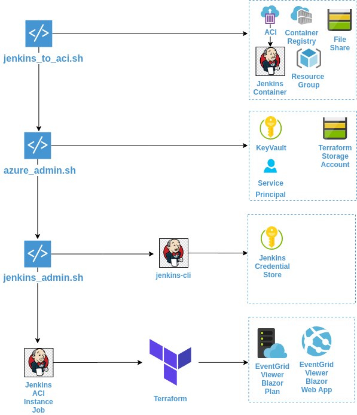

## Caveat

Please note that this tutorial should not be viewed as an indepth guide on how to properly configure & secure Jenkins.  This guide attempts to get a Jenkins instance up & running quickly so those new to Jenkins can start to work with the software with very little configuration overhead.  For a guide on how to secure Jenkins, see the [Securing Jenkins](https://www.jenkins.io/doc/book/system-administration/security/) entry in the official Jenkins User Handbook.

## Prerequisites

- An Azure account with elevated permissions to create Service Principals
- [azure-cli](https://docs.microsoft.com/en-us/cli/azure/install-azure-cli)
- [docker](https://www.docker.com/)
- [java](https://jdk.java.net/11/)

## Jenkins Docker Image

[Jenkins Docker Image](https://github.com/jenkinsci/docker/blob/master/README.md)

A custom Dockerfile was created to use the base jenkins image but also installs [terraform](https://www.terraform.io/downloads.html) & [azure-cli](https://docs.microsoft.com/en-us/cli/azure/install-azure-cli).

### Pre-Step Information

A *prefix* will need to be supplied to all bash scripts.  When the scripts create resources in Azure, they will use the naming convention *{resource_type}-{prefix}-jenkins-example* ie *rg-cse-jenkins-example*.  

Also note, some resources like Storage Accounts and Container Registries will not have any spaces in the name.  Please note that the resource names need to be unique & conform to [Azure Resource length rules](https://docs.microsoft.com/en-us/azure/azure-resource-manager/management/resource-name-rules), so choose a prefix based upon these guidelines.

Also, before installing Jenkins, it is recommended that you view the [troubleshooting](#troubleshooting) section.

### Step 1. - Run jenkins_to_aci.sh

The *jenkins_to_aci.sh* script located in the *scripts* directory is used to create a Azure Container Registry, upload the custom Jenkins image to the Azure Container Registry & deploys an Azure Container Instance with a Storage Account file share mount.

You can learn how to use the script by doing the following:

```bash
    chmod +x ./scripts/jenkins_to_aci.sh -h &&
    ./scripts/jenkins_to_aci.sh -h
```

Connect to the container to get the Jenkins Admin password:

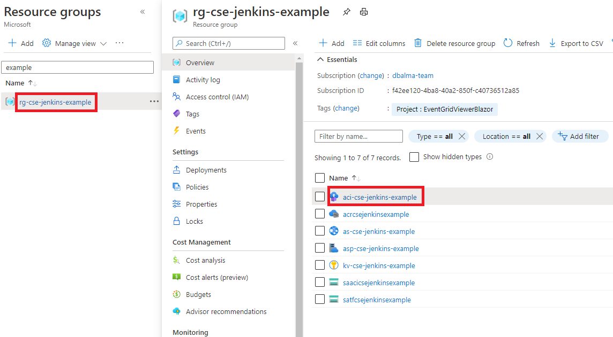
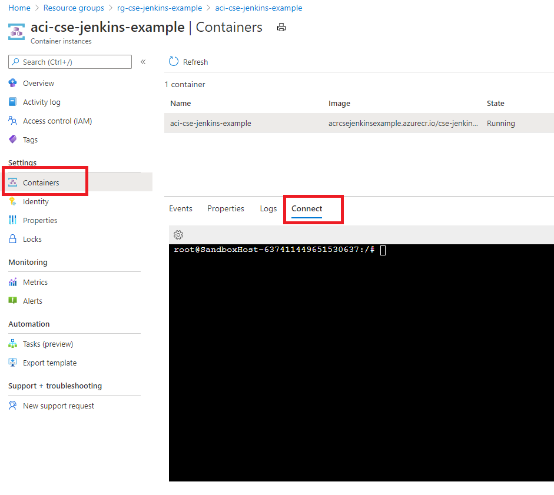

Run the following command in the command prompt to get the Jenkins Admin password:

```bash
cat /var/jenkins_home/secrets/initialAdminPassword
```

Log into Jenkins by navigating to <aci_FQDN>:8080 & do the following:

- Enter the admin password

    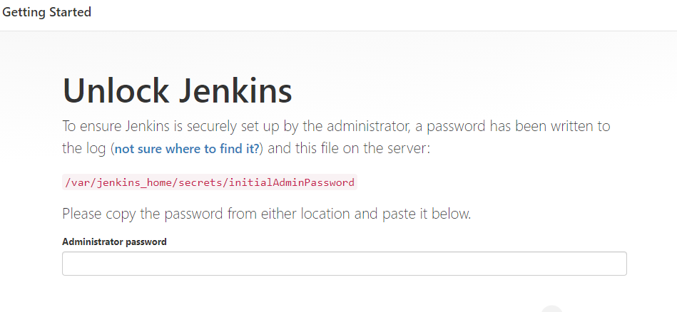

- Choose to install suggested plugins

    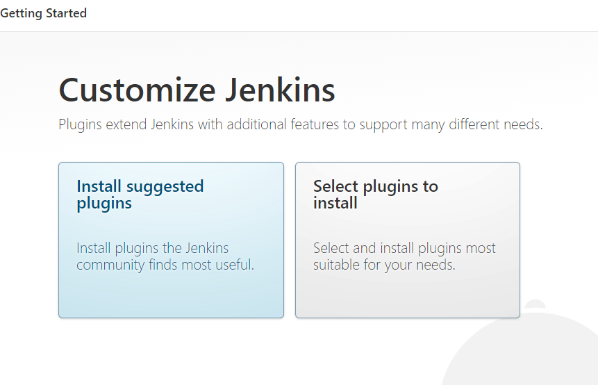

- Create the first admin user

    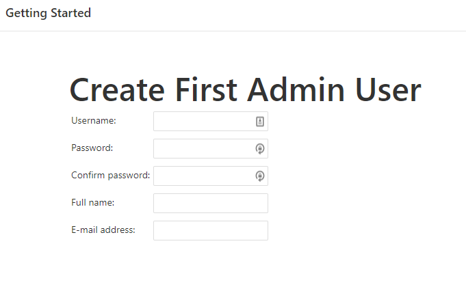

Once logged into Jenkins, on the home screen:

- Manage Jenkins -> Manage Plugins
- Choose the *Available* tab
- Install the following plugins:
  - [AnsiColor](https://plugins.jenkins.io/ansicolor/)
  - [Azure Credentials](https://plugins.jenkins.io/azure-credentials/)
  - [Azure KeyVault](https://plugins.jenkins.io/azure-keyvault/)
- Once all plugins are installed, restart Jenkins by navigating to the url: <aci_FQDN>:8080/restartFor tutorial purposes only, if you start to see error such as the screenshot below, you will need to enable proxy compatability:

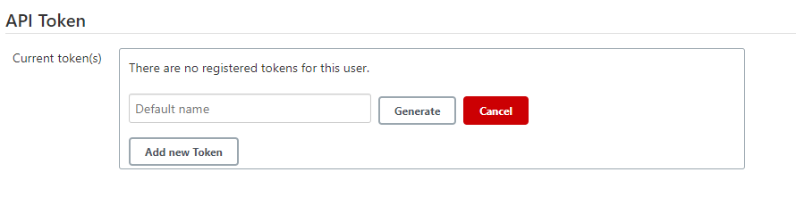

### Step 2. - Run azure_admin.sh

The *azure_admin.sh* script located in the *scripts* directory is used to create a Service Principal, Azure Storage Account and KeyVault.  The Service Principal will be granted read access to the KeyVault secrets and will be used by Jenkins.  The script will also set KeyVault secrets that will be used by Jenkins & Terraform.  

If you used the *jenkins_to_aci.sh* script to deploy Jenkins, use the same prefix and location to make cleaning up Azure resources easier after you are done with this tutorial.

You can learn how to use the script by doing the following:

```bash
    chmod +x ./scripts/azure_admin.sh -h &&
    ./scripts/azure_admin.sh -h
```

#### Secrets

- BACKEND-ACCESS-KEY - Terraform backend storage account primary access key.
- BACKEND-KEY - Terraform backend access key
- BACKEND-STORAGE-ACCOUNT-CONTAINER-NAME - Terraform backend storage account container name
- BACKEND-STORAGE-ACCOUNT-NAME - Terraform backend storage account
- EGVB-APP-SERVICE-NAME - EventGrid Viewer Blazor app service name
- EGVB-APP-SERVICE-PLAN-NAME - EventGrid Viewer Blazor app service plan name
- KV-NAME - The name of the Azure KeyVault
- LOCATION - Region Azure resources are deployed
- RG-NAME - Resource Group
- SERVICE-PRINCIPAL-APP-ID - Service Principal client id used by Jenkins
- SERVICE-PRINCIPAL-APP-SECRET - Service Principal app secret used by Jenkins
- SERVICE-PRINCIPAL-SUB-ID - Service Principal subscription id used by Jenkins
- SERVICE-PRINCIPAL-TENANT-ID - Service Principal tenant id used by Jenkins

### Step 3. - Run jenkins_admin.sh

The *jenkins_admin.sh* script located in the *scripts* directory is used by a Jenkins Admin to connect to the KeyVault created in the azure_admin.sh script, fetch Azure Service Principal information and store this information in Jenkins using jenkins-cli.  The Azure Service Principal credentials can then be used by Jenkins to connect to Azure.

**Note:** You will need a Jenkins API Token, which should have been generated in Step 1.

You can learn how to use the script by doing the following:

```bash
    chmod +x ./scripts/jenkins_admin.sh -h &&
    ./scripts/jenkins_admin.sh -h
```

Once you have run the script:

- Log into Jenkins
- Manage Jenkins -> Manage Credentials & you should see the credentials the script loaded into Jenkins

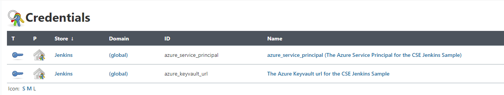

### Step 4. - Create & Run Jenkins Job

See [Create_Jenkins_Job](./Create_Jenkins_Job.md) Document

Once Steps 1-4 have been executed, you should have Azure resources deployed similar to the picture below:

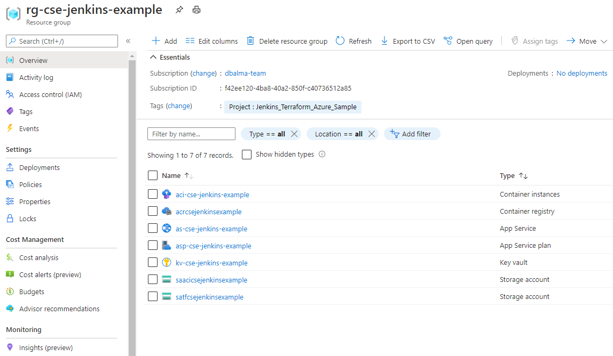

### Step 5. - Run cleanup_azure.sh

The *cleanup_azure.sh* script located in the *scripts* directory is used to delete Azure resources created by the scripts during the tutorial.

You can learn how to use the script by doing the following:

```bash
    chmod +x ./scripts/cleanup_azure.sh -h &&
    ./scripts/cleanup_azure.sh -h
```

### Troubleshooting

For tutorial purposes only, if you start to see errors such as the screenshot below, you will need to enable proxy compatability:

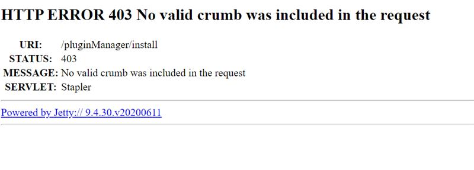

On the Jenkins Home Screen:

- Manage Jenkins -> Configure Global Security -> CSRF

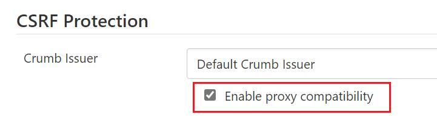
